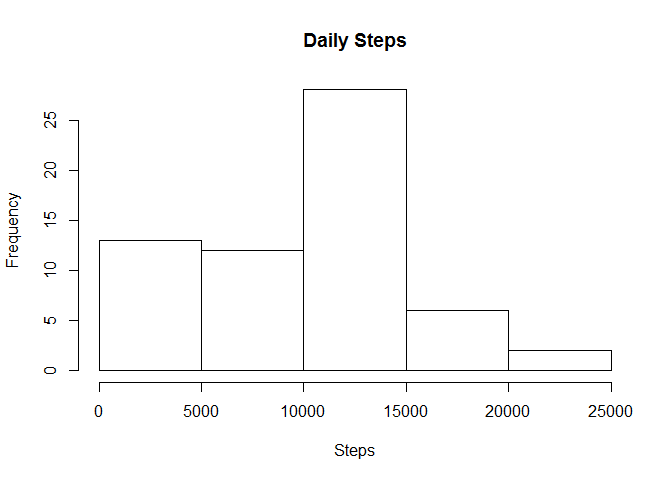
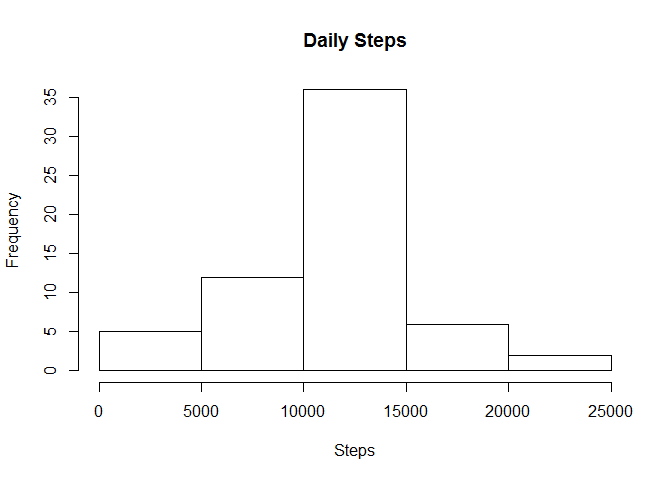
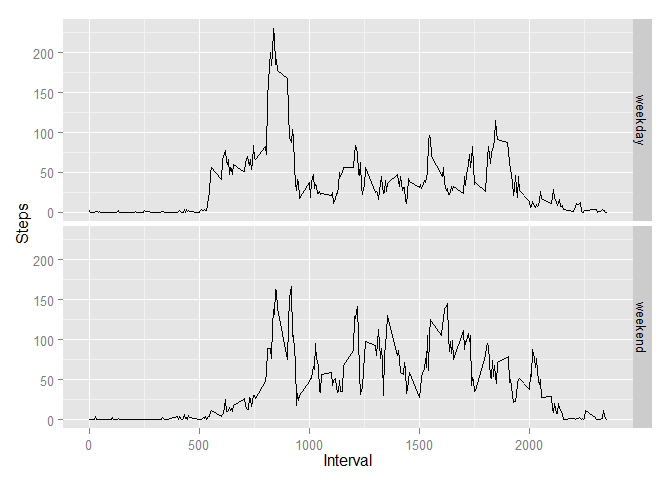

# Reproducible Research: Peer Assessment 1


## Loading and preprocessing the data


```r
unzip("activity.zip")
data <- read.csv("activity.csv")
```

## What is mean total number of steps taken per day?


```r
daily_steps <- aggregate(data$steps, by=list(data$date), FUN=sum, na.rm=TRUE)
names(daily_steps) <- c("day", "steps")
hist(daily_steps$steps, xlab = "Steps", main = "Daily Steps")
```

 


```r
steps_mean <- as.integer(round(mean(daily_steps$steps, na.rm = TRUE), 0))
steps_median <- median(daily_steps$steps, na.rm = TRUE)
```

Daily step mean count is 9354.  
Daily step median count is 10395.

## What is the average daily activity pattern?


```r
interval_steps <- aggregate(data$steps, by=list(data$interval), FUN="mean", na.action=na.pass, na.rm=TRUE)
names(interval_steps) <- c("interval", "steps")
plot(interval_steps, type = 'l', xlab = 'Interval', ylab = 'Average Steps')
```

 

```r
max_steps <- max(interval_steps$steps)
max_interval <- interval_steps$interval[interval_steps$steps == max_steps]
```

The interval that contains the average maximum number of steps is 835.

## Imputing missing values


```r
na_values <- sum(is.na(data$steps))
```

Data set contains 2304 NA values. Na values are replaces by interval's mean value.


```r
new_data <- data
for(i in 1 : nrow(new_data)) {
    if(is.na(new_data$steps[i])) {
        new_data$steps[i] <- as.integer(round(interval_steps$steps[interval_steps$interval == new_data$interval[i]], 0))
    }
}

new_daily_steps <- aggregate(new_data$steps, by=list(new_data$date), FUN=sum)
names(new_daily_steps) <- c("day", "steps")
hist(new_daily_steps$steps, xlab = "Steps", main = "Daily Steps")
```

 


```r
new_steps_mean <- as.integer(round(mean(new_daily_steps$steps), 0))
new_steps_median <- median(new_daily_steps$steps)
```

New daily step mean count is 10766. New daily step median count is 10762.  
Mean and median values are higher than the earlier estimates.  This is because data with NA values had more days with 0 steps.

## Are there differences in activity patterns between weekdays and weekends?

```r
weekend <- c('lauantai', 'sunnuntai') # Saturday and Sunday in Finnish
new_data$weekend[weekdays(as.Date(new_data$date)) %in% weekend] <- 'weekend'
new_data$weekend[is.na(new_data$weekend)] <- 'weekday'
new_data$weekend <- as.factor(new_data$weekend)

weekend_steps <- aggregate(new_data$steps, by=list(new_data$interval, new_data$weekend), FUN=mean)
colnames(weekend_steps) <- c("interval", "weekend", "steps")
library(ggplot2)
ggplot(weekend_steps, aes(interval, steps)) + geom_line() + facet_grid(weekend ~ .) +
    xlab("Interval") + ylab("Steps")
```

 

During weekdays there is an activity spike in the morning. During weekends activitys are more evenly distributed, there are multiple high points circa 150 steps during the day.
